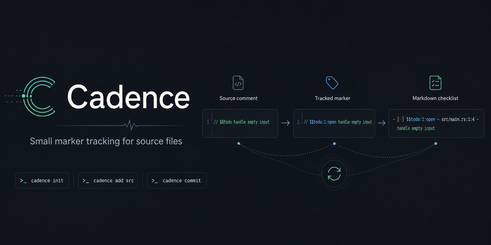

# Cadence

Small marker tracking for source files.




Cadence turns comments like this:

```rust
// $$todo handle empty input
```

into stable, checkable items:

```rust
// $$todo:1:open handle empty input
```

and mirrors them to Markdown in `.cadence/items/todo.md`.

## Install

```sh
cargo install --path .
```

## Quick Start

```sh
cadence init
```

Add markers to any source file:

```rust
// $$todo handle empty input
// $$fixme avoid duplicate work
// $$hack remove temporary branch
```

The prefix comes from `.cadence/config.yml`.

Stage files or directories and commit them to Cadence:

```sh
cadence add src/main.rs
# or: cadence add src
cadence commit
```

Cadence assigns IDs in the source file and writes Markdown checklists:

```md
- [ ] $$todo:1:open - src/main.rs:1:4 - handle empty input
```

Check an item in `.cadence/items/*.md`, then run:

```sh
cadence commit
```

The source marker status changes from `open` to `done`.

Add notes below any Markdown item; Cadence keeps them with that item:

```md
- [x] $$todo:3:done - src/main.rs:8:4 - final flux
  Happy
  Spring
  Break!
- [~] $$todo:4:in-progress - src/main.rs:12:4 - more daleks!
```

Customize checklist markers in `.cadence/schemas.yml`:

```yml
todo:
  statuses: ["open:[ ]", "done:[x]", "in-progress:[~]"]
```

## Commands

```sh
cadence init           # create .cadence/
cadence add <path>     # stage a file or directory
cadence commit         # sync source markers and Markdown
cadence reset          # clear staged files
```

`cadence add` stages directory contents recursively. `.cadence/` and its contents are never staged.

## Files

```text
.cadence/
  config.yml           # marker prefix
  schemas.yml          # default marker types
  db.json              # tracked items
  staged.json          # staged files
  items/
    <type>.md          # generated checklist
```
